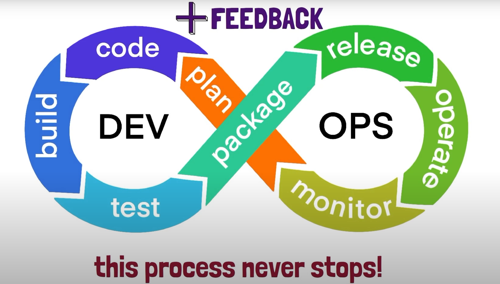
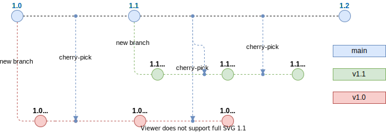

# **What is DevOps?**

+ Not a standart or specification.
+ Not a tool or a particular software.
+ Not something you do with a tool of software.
+ DevOps is a cultural thing, it represents a change in mindset.

## **For Example of DevOps**

The usual business process is `Customter > Project Manager > Developer > Tester > SysAdmins`. Now, let's zoom in in Developers and SysAdmins and their main task:

For the Developer
+ Building software.
+ Adding new features.

For SysAdmins
+ Building and maintaining the IT infrastructure.
+ With the system run smoothly, securely, and with as little downtime.

Both of them, there are something in common, that's the `Software`.

For the SysAdmin
+ Knows very little about the software that need to operate.

For the developer
+ Knows very little of the infrastructure where the software is running.

Everyone in the business process work together on the software just in a different capacity, since the final outcome impact everyone it makesense for all these groups to collaborate. The cultural shift that DevOps brings is also tightly connected to the agile movement.

Where business conditions and requirements change all the time and where we need to juggle tons of tools and technology every day, the best culture is not one of blaming and finger-pointing but one of experimentation and learning from past mistakes. So, we want to have everyone collaborate instead of working in silos and stages or instead of finger pointing everyone takes responsibility for the final outcome. If the final product works and the customers or the users of the product are happy. So, the DevOps are:

+ More than just culture.
+ Focus on automating their tasks.
+ Because of manual and repetitive works is a productivity killer.

So, the main concern of this repository are **automatically building and deploying software which fall under a pactice called CI/CD**. We want to automate as much as possible to save time and give us the chance to put that time to good use instead of manually repeating the same task over and over again. But to automate things we need to get good at:

+ Using the **shell**.
+ Working with the **CLI tools**.
+ Reading documentation.
+ And writing scripts.

And here's the simple representation of DevOps.



That proccess never stop, it goes on and on in an endless loop. It mean we contionue going through these steps with each iteration or new version of the software and get the **feedback** that add into the product. So, DevOps goes hand in hand with the agile movement.

# **GitLab CI/CD**

+ Automation engine.
+ Enables teams to perform DevOps pactices.
  + Continous Integration.
  + Continous Delivery/Deployment.
+ Automatically build, test, and deploy using GitLab pipeline.

# **GitLab Pipelines**

+ `.gitlab-ci.yml` from the root of the project repository.
+ Automated set of sequential steps to build, test, and deliver/deploy the code.
+ GitLab pipeline have two main components.
  + **Jobs** describe the tasks that need to be done.
  + **Stages** define the order in which jobs will be completed.
+ Set of instructions for a program to execute.
+ **Gitlab Runner** is the program that executes jobs in a GitLab pipeline.

## **GitLab Runner**

+ Separate program that can be run on **your local host**, **VM** or even **container**.
+ GitLab assigns pipeline jobs to available runners at pipeline runtime.

## **Main Feature of GitLab CI/CD**

+ Enter **CI/CD** menu and Select **Pipelines** and check the template example.
+ Or enter the **Editor** and select **Create new CI/CD pipelines**.
+ To check the visualiztion of CI/CD, check the **Visualize** tab.
+ To check the correct syntax, check the **Lint** tab.

## **Setup Pipeline from Editor into the Visualize**

Here is the example of pipeline script in `.gitlab-ci.yml` that can edit from the Editor.

```
stages:          # List of stages for jobs, and their order of execution
  - build
  - test
  - deploy

build-job:       # This job runs in the build stage, which runs first.
  stage: build
  script:
    - echo "Compiling the code..."
    - echo "Compile complete."

unit-test-job:   # This job runs in the test stage.
  stage: test    # It only starts when the job in the build stage completes successfully.
  script:
    - echo "Running unit tests... This will take about 60 seconds."
    - echo "Code coverage is 90%"

lint-test-job:   # This job also runs in the test stage.
  stage: test    # It can run at the same time as unit-test-job (in parallel).
  script:
    - echo "Linting code... This will take about 10 seconds."
    - echo "No lint issues found."

deploy-job:      # This job runs in the deploy stage.
  stage: deploy  # It only runs when *both* jobs in the test
   stage complete successfully.
  script:
    - echo "Deploying application..."
    - echo "Application successfully deployed."
```

Here are the main syntax of editor in the GitLab CI:

+ **`stages`**

    Inside the `stages`, there are:
    + `build`
    + `test`
    + `deploy`

The `stages` calls in every single CI/CD step like (for example from script above):
+ The `build-job` step has `build` stages.
+ The `unit-test-job` step has `test` stages.
+ The `lint-test-job` step has `test` stages.
+ The `deploy-job` step has `deploy` stages.

## **Docker Images**

Add docker images to execute the pipeline. It's like the environment where the CI/CD runs. Here's the config example:

```
image: python:latest
stages:                 # List of stages for jobs, and their order of execution
  - build
  - test
  - deploy

...
```

## **Pipeline Environment Variables**

Add variable that gonna use by the pipeline, you can describe it in the `.gitlab-ci.yml`. Here the example:

```
image: python:latest

variable:
  USERNAME: rohwid

stages:                 # List of stages for jobs, and their order of execution
  - build
  - test
  - deploy

...
```

Or define with the GitLab repository setting in `Settings > CI/CD > Variable > Collapse`. You can set the variable into two modes like:

+ **Protected**: Only can be run in the current branch.
+ **Masked**: Hide or encrypt the variable.

# **GitLab Runner**

+ Open source application that is used to run jobs in a GitLab CI/CD pipeline.
+ Pipeline jobs are assigned to available GitLab Runners.
+ The program can be installed on our local machine, VM, or Docker container and Cloud infrastructure.
+ Supported on Linux, Windows, macOS, and FreeBSD.
+ GitLab Runners execute the work defined in GitLab pipeline jobs (check the tasks on `script`).

  ```
  build-job:       # This job runs in the build stage, which runs first.
  stage: build
  script:
    - echo "Compiling the code..."
    - echo "Compile complete."
  ```

## **GitLab Runner Types**

Here are the types of GitLab runner.

+ **Shared**: Available to all projects in a GitLab instance.
+ **Group**: Available to all projects in a group.
+ **Project**: For a single project or a set of project with specific requirements.

## **GitLab Runner Executor**

The GitLab Runner executor determines the environment in which a job will run.
+ In a VM vua a hypervisor such as VirtualBox
+ Shell
+ Remote SSH
+ Docker
+ Kubernetes
+ Custom executor (for environment that not supported by GitLab runner environment)

## **GitLab Runner Monitoring**

The runner program has an embedded Prometheus metric HTTP server for monitoring
+ Runner bussiness logic metrics
+ Go-specific process metrics
+ General process metrics
+ Build version information

## **Tags**

What is tags in GitLab CI/CD pipeline:
+ Tags can be added to a GitLab runner that can be reference in GitLab pipeline.
+ Reference tags from within a GitLab pipeline to **specify which runners should be used for a job**.
+ More explanation in the [docs](https://docs.gitlab.com/ee/ci/yaml/#tags).

## **Self-hosted Runners**

Why self-host runners?
+ Save on costs by using self-managed/hosted runners
+ Customization
+ Security

## **Steps for Self-hosting**

Here are the steps:
+ Install runner program on target host.
+ Choose an executor.
+ Register GitLab runner.
+ Run a pipeline that utilizes your runner.

## **Pre-requisites**

Before use GitLab pipeline we needs:
+ GitLab account.
+ VM or other infrastructure.
  + In this example: I'll be using a Linux machine as the GitLab Runner's host.
+ GitLab project.
+ Docker installed on target host where GitLab Runner will be installed.


Define the GitLab runners in GitLab repository setting in `Settings > CI/CD > Variable > Collapse`. There are two runners there are:

+ **Specific Runners**: Setup runners for the specific project on our local machinge, VM, or Docker container.
+ **Shared Runners**: Use the runners that provide by GitLab.

## **Setup Runners**

Setup GitLab runner on VM

## **GitLab CI/CD Cache**

Check the [docs](https://docs.gitlab.com/ee/ci/caching/) to setup the cache.

# **Step by Step GitLab CI**

+ Create the repository `try-gitlab-ci`.
+ Create `.gitlab-ci.yml` file and commit.
+ Create and define the stages.

    ```
    stages:
      - build
      - test
      - ship
    ```

    And call all the stages in every pipeline job. So, the script will be like this:
    
    ```
    ...
    
    build-job:
    stage: build
    script:
        - mkdir build
        - touch build/computer.txt
        - echo "Build the computer..."
        - echo "- CPU" >> build/computer.txt
        - echo "- Mainboard" >> build/computer.txt
        - echo "- RAM" >> build/computer.txt
        - echo "- SSD" >> build/computer.txt
        - echo "- Monitor" >> build/computer.txt
        - echo "- Keyboard" >> build/computer.txt
        - echo "- Mouse" >> build/computer.txt
        - echo "Build complete."

    test-job:
    stage: test
    script:
        - echo "Checking the components... This will take about 10 seconds."
        - test -f build/computer.txt 
        - cat build/computer.txt

    ship-job:
    stage: ship
    script:
        - echo "shiping the computer..."
        - mkdir ship
        - cp build/computer.txt ship
        - echo "The computer successfully shiped."
        - cat ship/computer.txt
    ```

+ Setup the artifacts paths.

    ```
    artifacts:
        paths:
        - build
    ```
    And call the artifact path in the pipeline job that needed. So, the script will be like this:

    ```
    ...

    build-job:
    stage: build
    script:
        - ls
        - mkdir build
        - touch build/computer.txt
        - echo "Build the computer..."
        - echo "- CPU" >> build/computer.txt
        - echo "- Mainboard" >> build/computer.txt
        - echo "- RAM" >> build/computer.txt
        - echo "- SSD" >> build/computer.txt
        - echo "- Monitor" >> build/computer.txt
        - echo "- Keyboard" >> build/computer.txt
        - echo "- Mouse" >> build/computer.txt
        - echo "Build complete."
    artifacts:
        paths:
        - build

    ...
    ```

+ Setup the variables.

    ```
    variables:
        BUILD_FILE_NAME: computer.txt
    ```

    And replace some config with variables name.

+ Set the GitLab **Setting** in **General**:

  + Use **Fast-forward merge** method.
  + **Squash commit when mergin** into **Encourage**.
  + **Merge checks** when **Pipelines must succeed**.

+ Set the GitLab **Setting** in **Repository**:
  
  + **Allowed to push** into **No one**.

+ That setting allow us to manage the repository easier, just the `main` branch and the **deployed version**.

